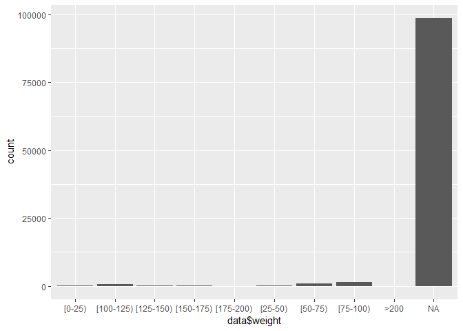
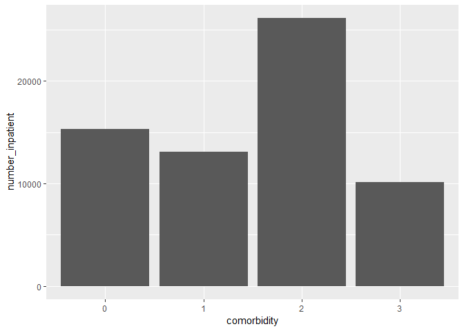

Risk Stratification
================

Risk stratification of diabetic patients for readmission

EDA and Feature engineering

``` r
data <- read.csv("data/diabetic_data_original.csv", header=TRUE, 
                 na.strings = c("NA","na",""," ","?"), stringsAsFactors = FALSE)
```

Checking structure of data

``` r
str(data)
```

    ## 'data.frame':    101766 obs. of  50 variables:
    ##  $ encounter_id            : int  2278392 149190 64410 500364 16680 35754 55842 63768 12522 15738 ...
    ##  $ patient_nbr             : int  8222157 55629189 86047875 82442376 42519267 82637451 84259809 114882984 48330783 63555939 ...
    ##  $ race                    : chr  "Caucasian" "Caucasian" "AfricanAmerican" "Caucasian" ...
    ##  $ gender                  : chr  "Female" "Female" "Female" "Male" ...
    ##  $ age                     : chr  "[0-10)" "[10-20)" "[20-30)" "[30-40)" ...
    ##  $ weight                  : chr  NA NA NA NA ...
    ##  $ admission_type_id       : int  6 1 1 1 1 2 3 1 2 3 ...
    ##  $ discharge_disposition_id: int  25 1 1 1 1 1 1 1 1 3 ...
    ##  $ admission_source_id     : int  1 7 7 7 7 2 2 7 4 4 ...
    ##  $ time_in_hospital        : int  1 3 2 2 1 3 4 5 13 12 ...
    ##  $ payer_code              : chr  NA NA NA NA ...
    ##  $ medical_specialty       : chr  "Pediatrics-Endocrinology" NA NA NA ...
    ##  $ num_lab_procedures      : int  41 59 11 44 51 31 70 73 68 33 ...
    ##  $ num_procedures          : int  0 0 5 1 0 6 1 0 2 3 ...
    ##  $ num_medications         : int  1 18 13 16 8 16 21 12 28 18 ...
    ##  $ number_outpatient       : int  0 0 2 0 0 0 0 0 0 0 ...
    ##  $ number_emergency        : int  0 0 0 0 0 0 0 0 0 0 ...
    ##  $ number_inpatient        : int  0 0 1 0 0 0 0 0 0 0 ...
    ##  $ diag_1                  : chr  "250.83" "276" "648" "8" ...
    ##  $ diag_2                  : chr  NA "250.01" "250" "250.43" ...
    ##  $ diag_3                  : chr  NA "255" "V27" "403" ...
    ##  $ number_diagnoses        : int  1 9 6 7 5 9 7 8 8 8 ...
    ##  $ max_glu_serum           : chr  "None" "None" "None" "None" ...
    ##  $ A1Cresult               : chr  "None" "None" "None" "None" ...
    ##  $ metformin               : chr  "No" "No" "No" "No" ...
    ##  $ repaglinide             : chr  "No" "No" "No" "No" ...
    ##  $ nateglinide             : chr  "No" "No" "No" "No" ...
    ##  $ chlorpropamide          : chr  "No" "No" "No" "No" ...
    ##  $ glimepiride             : chr  "No" "No" "No" "No" ...
    ##  $ acetohexamide           : chr  "No" "No" "No" "No" ...
    ##  $ glipizide               : chr  "No" "No" "Steady" "No" ...
    ##  $ glyburide               : chr  "No" "No" "No" "No" ...
    ##  $ tolbutamide             : chr  "No" "No" "No" "No" ...
    ##  $ pioglitazone            : chr  "No" "No" "No" "No" ...
    ##  $ rosiglitazone           : chr  "No" "No" "No" "No" ...
    ##  $ acarbose                : chr  "No" "No" "No" "No" ...
    ##  $ miglitol                : chr  "No" "No" "No" "No" ...
    ##  $ troglitazone            : chr  "No" "No" "No" "No" ...
    ##  $ tolazamide              : chr  "No" "No" "No" "No" ...
    ##  $ examide                 : chr  "No" "No" "No" "No" ...
    ##  $ citoglipton             : chr  "No" "No" "No" "No" ...
    ##  $ insulin                 : chr  "No" "Up" "No" "Up" ...
    ##  $ glyburide.metformin     : chr  "No" "No" "No" "No" ...
    ##  $ glipizide.metformin     : chr  "No" "No" "No" "No" ...
    ##  $ glimepiride.pioglitazone: chr  "No" "No" "No" "No" ...
    ##  $ metformin.rosiglitazone : chr  "No" "No" "No" "No" ...
    ##  $ metformin.pioglitazone  : chr  "No" "No" "No" "No" ...
    ##  $ change                  : chr  "No" "Ch" "No" "Ch" ...
    ##  $ diabetesMed             : chr  "No" "Yes" "Yes" "Yes" ...
    ##  $ readmitted              : chr  "NO" ">30" "NO" "NO" ...

Check for NA

``` r
sapply(data, function(x) sum(is.na(x))) 
```

    ##             encounter_id              patient_nbr                     race 
    ##                        0                        0                     2273 
    ##                   gender                      age                   weight 
    ##                        0                        0                    98569 
    ##        admission_type_id discharge_disposition_id      admission_source_id 
    ##                        0                        0                        0 
    ##         time_in_hospital               payer_code        medical_specialty 
    ##                        0                    40256                    49949 
    ##       num_lab_procedures           num_procedures          num_medications 
    ##                        0                        0                        0 
    ##        number_outpatient         number_emergency         number_inpatient 
    ##                        0                        0                        0 
    ##                   diag_1                   diag_2                   diag_3 
    ##                       21                      358                     1423 
    ##         number_diagnoses            max_glu_serum                A1Cresult 
    ##                        0                        0                        0 
    ##                metformin              repaglinide              nateglinide 
    ##                        0                        0                        0 
    ##           chlorpropamide              glimepiride            acetohexamide 
    ##                        0                        0                        0 
    ##                glipizide                glyburide              tolbutamide 
    ##                        0                        0                        0 
    ##             pioglitazone            rosiglitazone                 acarbose 
    ##                        0                        0                        0 
    ##                 miglitol             troglitazone               tolazamide 
    ##                        0                        0                        0 
    ##                  examide              citoglipton                  insulin 
    ##                        0                        0                        0 
    ##      glyburide.metformin      glipizide.metformin glimepiride.pioglitazone 
    ##                        0                        0                        0 
    ##  metformin.rosiglitazone   metformin.pioglitazone                   change 
    ##                        0                        0                        0 
    ##              diabetesMed               readmitted 
    ##                        0                        0

### Check variable

``` r
# encounter_id
length(unique(data$encounter_id))
```

    ## [1] 101766

``` r
# 101766 variable, no duplicate
 #  remove encounterid
data <- subset(data, select=-c(encounter_id))
```

``` r
# patient_nbr
# Save the patient id to identify the patien after analysis
Patient_Id <- data$patient_nbr
#  remove unwanted variable
data <- subset(data, select=-c(patient_nbr))
```

``` r
# race
table(data$race)
```

    ## 
    ## AfricanAmerican           Asian       Caucasian        Hispanic 
    ##           19210             641           76099            2037 
    ##           Other 
    ##            1506

``` r
# AfricanAmerican: 19210, Asian: 641, Caucasian: 76099, Hispanic: 2037, Other: 1506 
class(data$race)
```

    ## [1] "character"

``` r
data$race <- as.factor(data$race)
class(data$race)
```

    ## [1] "factor"

``` r
# gender
table(data$gender)
```

    ## 
    ##          Female            Male Unknown/Invalid 
    ##           54708           47055               3

``` r
#Female : 54708, Male: 47055, Unknown/Invalid: 3
class(data$gender)
```

    ## [1] "character"

``` r
data$gender <- replace(data$gender, data$gender == "Unknown/Invalid", NA)
table(data$gender)
```

    ## 
    ## Female   Male 
    ##  54708  47055

``` r
#convert gender to as.numeric
summary(factor(data$gender))
```

    ## Female   Male   NA's 
    ##  54708  47055      3

``` r
# convert to factor
data$gender <- as.factor(data$gender)
# give values 1 and 0 to the factors
levels(data$gender)<-c(1,0)
#convert to as.numeric
data$gender <- as.numeric(levels(data$gender))[data$gender]
summary(data$gender)
```

    ##    Min. 1st Qu.  Median    Mean 3rd Qu.    Max.    NA's 
    ##  0.0000  0.0000  1.0000  0.5376  1.0000  1.0000       3

``` r
# Age
table(data$age)
```

    ## 
    ##   [0-10)  [10-20)  [20-30)  [30-40)  [40-50)  [50-60)  [60-70)  [70-80) 
    ##      161      691     1657     3775     9685    17256    22483    26068 
    ##  [80-90) [90-100) 
    ##    17197     2793

Reducing the levels

``` r
table(data$age)
```

    ## 
    ##     1     2     3     4     5     6     7 
    ##   161   691  5432 26941 22483 26068 19990

``` r
ggplot(data, aes(data$age)) + geom_bar()
```


``` r
data$age <- as.factor(data$age)
```

``` r
# weight
table(data$weight)
```

    ## 
    ##    [0-25) [100-125) [125-150) [150-175) [175-200)   [25-50)   [50-75) 
    ##        48       625       145        35        11        97       897 
    ##  [75-100)      >200 
    ##      1336         3

``` r
summary(data$weight)
```

    ##    Length     Class      Mode 
    ##    101766 character character

``` r
sum(is.na(data$weight))
```

    ## [1] 98569

Checking if the data is unbalanced

``` r
ggplot(data, aes(data$weight)) + geom_bar()
```



``` r
data <- subset(data, select=-c(weight))
```

``` r
#admission_type_id
table(data$admission_type_id)
```

    ## 
    ##     1     2     3     4     5     6     7     8 
    ## 53990 18480 18869    10  4785  5291    21   320

Reducing the levels

``` r
table(data$admission_type_id)
```

    ## 
    ##     1     3     4     5     7 
    ## 72470 18869    10 10396    21

``` r
data$admission_type_id <- as.factor(data$admission_type_id)
```

``` r
# discharge_disposition_id 1 8 16 17 27 30 
table(data$discharge_disposition_id)
```

    ## 
    ##     1     2     3     4     5     6     7     8     9    10    11    12 
    ## 60234  2128 13954   815  1184 12902   623   108    21     6  1642     3 
    ##    13    14    15    16    17    18    19    20    22    23    24    25 
    ##   399   372    63    11    14  3691     8     2  1993   412    48   989 
    ##    27    28 
    ##     5   139

Reducing the levels, grouping similar discharge dispositions

``` r
# 11 19 20 21# Few are grouped together
data$discharge_disposition_id <- replace(data$discharge_disposition_id, data$discharge_disposition_id == 11, "group4")  
data$discharge_disposition_id <- replace(data$discharge_disposition_id, data$discharge_disposition_id == 19, "group4")  
data$discharge_disposition_id <- replace(data$discharge_disposition_id, data$discharge_disposition_id == 20, "group4")  
data$discharge_disposition_id <- replace(data$discharge_disposition_id, data$discharge_disposition_id == 21, "group4")  
```

``` r
table(data$discharge_disposition_id)
```

    ## 
    ##     1     2     3     4 
    ## 60372 34436  5306  1652

``` r
summary(data$discharge_disposition_id)
```

    ##    Length     Class      Mode 
    ##    101766 character character

``` r
data$discharge_disposition_id <- as.factor(data$discharge_disposition_id)
```

``` r
# admission_source_id
table(data$admission_source_id)
```

    ## 
    ##     1     2     3     4     5     6     7     8     9    10    11    13 
    ## 29565  1104   187  3187   855  2264 57494    16   125     8     2     1 
    ##    14    17    20    22    25 
    ##     2  6781   161    12     2

``` r
ggplot(data, aes(data$admission_source_id)) + geom_bar()
```


``` r
table(data$admission_source_id)
```

    ## 
    ##     1     2     3     4 
    ## 30872 63822  7067     5

``` r
data$admission_source_id <- as.factor(data$admission_source_id)
```

``` r
# time_in_hospital
table(data$time_in_hospital)
```

    ## 
    ##     1     2     3     4     5     6     7     8     9    10    11    12 
    ## 14208 17224 17756 13924  9966  7539  5859  4391  3002  2342  1855  1448 
    ##    13    14 
    ##  1210  1042

``` r
ggplot(data, aes(data$time_in_hospital)) + geom_bar()
```


``` r
str(data$time_in_hospital)
```

    ##  int [1:101766] 1 3 2 2 1 3 4 5 13 12 ...

``` r
# Payercode
ggplot(data, aes(data$payer_code)) + geom_bar()
```


``` r
 #  remove unwanted variable, not helpful as not patient disease info
data <- subset(data, select=-c(payer_code))
```

``` r
# medical_specialty
table(data$medical_specialty)
```

    ## 
    ##                 AllergyandImmunology                       Anesthesiology 
    ##                                    7                                   12 
    ##             Anesthesiology-Pediatric                           Cardiology 
    ##                                   19                                 5352 
    ##                 Cardiology-Pediatric                              DCPTEAM 
    ##                                    7                                    6 
    ##                            Dentistry                          Dermatology 
    ##                                    4                                    1 
    ##                     Emergency/Trauma                        Endocrinology 
    ##                                 7565                                  120 
    ##             Endocrinology-Metabolism               Family/GeneralPractice 
    ##                                    8                                 7440 
    ##                     Gastroenterology                           Gynecology 
    ##                                  564                                   58 
    ##                           Hematology                  Hematology/Oncology 
    ##                                   82                                  207 
    ##                          Hospitalist                   InfectiousDiseases 
    ##                                   57                                   37 
    ##                     InternalMedicine                           Nephrology 
    ##                                14635                                 1613 
    ##                            Neurology                      Neurophysiology 
    ##                                  203                                    1 
    ## Obsterics&Gynecology-GynecologicOnco                           Obstetrics 
    ##                                   25                                   19 
    ##              ObstetricsandGynecology                             Oncology 
    ##                                  671                                  348 
    ##                        Ophthalmology                          Orthopedics 
    ##                                   38                                 1400 
    ##           Orthopedics-Reconstructive                            Osteopath 
    ##                                 1233                                   39 
    ##                       Otolaryngology                     OutreachServices 
    ##                                  125                                   12 
    ##                            Pathology                           Pediatrics 
    ##                                   17                                  254 
    ##      Pediatrics-AllergyandImmunology              Pediatrics-CriticalCare 
    ##                                    3                                   87 
    ##         Pediatrics-EmergencyMedicine             Pediatrics-Endocrinology 
    ##                                    3                                  159 
    ##       Pediatrics-Hematology-Oncology        Pediatrics-InfectiousDiseases 
    ##                                    4                                    1 
    ##                 Pediatrics-Neurology               Pediatrics-Pulmonology 
    ##                                   10                                   25 
    ##                         Perinatology    PhysicalMedicineandRehabilitation 
    ##                                    1                                  391 
    ##                    PhysicianNotFound                             Podiatry 
    ##                                   11                                  100 
    ##                           Proctology                           Psychiatry 
    ##                                    1                                  854 
    ##                 Psychiatry-Addictive          Psychiatry-Child/Adolescent 
    ##                                    1                                    7 
    ##                           Psychology                          Pulmonology 
    ##                                  101                                  871 
    ##                          Radiologist                            Radiology 
    ##                                 1140                                   53 
    ##                             Resident                         Rheumatology 
    ##                                    2                                   17 
    ##                               Speech                       SportsMedicine 
    ##                                    1                                    1 
    ##                              Surgeon               Surgery-Cardiovascular 
    ##                                   45                                   98 
    ##      Surgery-Cardiovascular/Thoracic                 Surgery-Colon&Rectal 
    ##                                  652                                   11 
    ##                      Surgery-General                Surgery-Maxillofacial 
    ##                                 3099                                   11 
    ##                        Surgery-Neuro                    Surgery-Pediatric 
    ##                                  468                                    8 
    ##                      Surgery-Plastic     Surgery-PlasticwithinHeadandNeck 
    ##                                   41                                    1 
    ##                     Surgery-Thoracic                     Surgery-Vascular 
    ##                                  109                                  533 
    ##                    SurgicalSpecialty                              Urology 
    ##                                   33                                  685

``` r
ggplot(data, aes(data$medical_specialty)) + geom_bar()
```


``` r
#  remove unwanted variable
data <- subset(data, select=-c(medical_specialty))
```

``` r
ggplot(data, aes(data$num_lab_procedures)) + geom_bar()
```


``` r
quantile(data$num_lab_procedures, seq(0,1, 0.01))
```

    ##   0%   1%   2%   3%   4%   5%   6%   7%   8%   9%  10%  11%  12%  13%  14% 
    ##    1    1    1    1    2    4    7    9   10   12   14   16   18   19   20 
    ##  15%  16%  17%  18%  19%  20%  21%  22%  23%  24%  25%  26%  27%  28%  29% 
    ##   22   23   24   25   26   27   28   29   30   31   31   32   33   34   34 
    ##  30%  31%  32%  33%  34%  35%  36%  37%  38%  39%  40%  41%  42%  43%  44% 
    ##   35   35   36   36   37   37   38   38   39   39   40   40   41   41   42 
    ##  45%  46%  47%  48%  49%  50%  51%  52%  53%  54%  55%  56%  57%  58%  59% 
    ##   42   43   43   43   44   44   45   45   45   46   46   47   47   48   48 
    ##  60%  61%  62%  63%  64%  65%  66%  67%  68%  69%  70%  71%  72%  73%  74% 
    ##   49   49   50   50   51   51   52   52   53   54   54   55   55   56   56 
    ##  75%  76%  77%  78%  79%  80%  81%  82%  83%  84%  85%  86%  87%  88%  89% 
    ##   57   57   58   59   59   60   61   61   62   63   63   64   65   66   66 
    ##  90%  91%  92%  93%  94%  95%  96%  97%  98%  99% 100% 
    ##   67   68   69   71   72   73   75   77   80   85  132

``` r
data$num_lab_procedures[data$num_lab_procedures > quantile(data$num_lab_procedures, 0.99)] <- 
  quantile(data$num_lab_procedures, 0.99)
ggplot(data, aes(data$num_lab_procedures)) + geom_bar()
```


``` r
ggplot(data, aes(data$num_procedures)) + geom_bar()
```


``` r
ggplot(data, aes(data$num_medications)) + geom_bar()
```


``` r
quantile(data$num_medications, seq(0,1, 0.01))
```

    ##   0%   1%   2%   3%   4%   5%   6%   7%   8%   9%  10%  11%  12%  13%  14% 
    ##    1    3    4    5    5    6    6    6    7    7    7    7    8    8    8 
    ##  15%  16%  17%  18%  19%  20%  21%  22%  23%  24%  25%  26%  27%  28%  29% 
    ##    8    9    9    9    9    9   10   10   10   10   10   11   11   11   11 
    ##  30%  31%  32%  33%  34%  35%  36%  37%  38%  39%  40%  41%  42%  43%  44% 
    ##   11   11   12   12   12   12   12   12   13   13   13   13   13   14   14 
    ##  45%  46%  47%  48%  49%  50%  51%  52%  53%  54%  55%  56%  57%  58%  59% 
    ##   14   14   14   14   15   15   15   15   15   15   16   16   16   16   16 
    ##  60%  61%  62%  63%  64%  65%  66%  67%  68%  69%  70%  71%  72%  73%  74% 
    ##   17   17   17   17   17   18   18   18   18   19   19   19   19   20   20 
    ##  75%  76%  77%  78%  79%  80%  81%  82%  83%  84%  85%  86%  87%  88%  89% 
    ##   20   20   21   21   21   22   22   22   23   23   24   24   25   25   26 
    ##  90%  91%  92%  93%  94%  95%  96%  97%  98%  99% 100% 
    ##   26   27   28   28   29   31   32   34   37   43   81

``` r
data$num_medications[data$num_medications > quantile(data$num_medications, 0.99)] <- 
  quantile(data$num_medications, 0.99)
ggplot(data, aes(data$num_medications)) + geom_bar()
```


``` r
ggplot(data, aes(data$number_outpatient)) + geom_bar()
```


``` r
ggplot(data, aes(data$number_emergency)) + geom_bar()
```


``` r
ggplot(data, aes(data$number_inpatient)) + geom_bar()
```


``` r
ggplot(data, aes(data$number_diagnoses)) + geom_bar()
```


``` r
ggplot(data, aes(data$max_glu_serum)) + geom_bar()
```


``` r
# A1Cresult compensate for this column
#  remove unwanted variable
data <- subset(data, select=-c(max_glu_serum))
#A1Cresult
ggplot(data, aes(data$A1Cresult)) + geom_bar()
```


``` r
ggsave("figs/A1C.png")
```

    ## Saving 7 x 5 in image

``` r
data$A1Cresult <- as.factor(data$A1Cresult)
```

``` r
# remove unwanted variable as this is not taken in to account in this analysis

data <- subset(data, select=-c(metformin,repaglinide,nateglinide,chlorpropamide,glimepiride,
                        acetohexamide,glipizide,glyburide,tolbutamide,pioglitazone,
                        rosiglitazone,acarbose,miglitol,troglitazone,tolazamide,examide,
                        citoglipton,glyburide.metformin,glipizide.metformin,
                        glimepiride.pioglitazone,metformin.rosiglitazone,
                        metformin.pioglitazone))
# head(data)
```

``` r
#change
ggplot(data, aes(data$change)) + geom_bar()
```


``` r
data$change <- replace(data$change, data$change == "Ch", "1")
data$change <- replace(data$change, data$change == "No", "0")
# convert to factor
summary(factor(data$change))
```

    ##     0     1 
    ## 54755 47011

``` r
data$change <- as.numeric(data$change)
str(data$change)
```

    ##  num [1:101766] 0 1 0 1 1 0 1 0 1 1 ...

``` r
#diabetesMed
ggplot(data, aes(data$diabetesMed)) + geom_bar()
```


``` r
data$diabetesMed <- replace(data$diabetesMed, data$diabetesMed == "Yes", "1")
data$diabetesMed <- replace(data$diabetesMed, data$diabetesMed == "No", "0")
#convert gender to as.numeric
summary(factor(data$diabetesMed))
```

    ##     0     1 
    ## 23403 78363

``` r
data$diabetesMed <- as.numeric(data$diabetesMed)
str(data$diabetesMed)
```

    ##  num [1:101766] 0 1 1 1 1 1 1 1 1 1 ...

``` r
#readmitted
ggplot(data, aes(data$readmitted)) + geom_bar()
```


``` r
data$readmitted <- replace(data$readmitted, data$readmitted == "<30", "YES")
data$readmitted <- replace(data$readmitted, data$readmitted == ">30", "YES")
ggplot(data, aes(data$readmitted)) + geom_bar()
```


``` r
summary(factor(data$readmitted))
```

    ##    NO   YES 
    ## 54864 46902

Feature engineering

Converting comorbidity conditions to analyseable format

``` r
## diab_code <- 250.xx
## circulatory_code <- 390-459, 785
## Not diabetic or have BP=0, diabetic alone=1, BP alone=2, both diabetic and BP=3

diagnosis <- data.frame(diag1 = as.character(data$diag_1),
                        diag2 = as.character(data$diag_2),
                        diag3 = as.character(data$diag_3),
                        stringsAsFactors = F)
str(diagnosis)
```

    ## 'data.frame':    101766 obs. of  3 variables:
    ##  $ diag1: chr  "250.83" "276" "648" "8" ...
    ##  $ diag2: chr  NA "250.01" "250" "250.43" ...
    ##  $ diag3: chr  NA "255" "V27" "403" ...

``` r
diagnosis[is.na(diagnosis) == T] <- 0

make_comorbidity <- function(x){
  
  comorbidity <- character(length = nrow(data))
  diabetes_code <- "^[2][5][0]"
  circulatory_code <- "^[3][9][0-9]|^[4][0-5][0-9]"
  
  if((str_detect(x[1], diabetes_code) == F & (str_detect(x[2], circulatory_code) == F & str_detect(x[3], circulatory_code) == F)) |
     (str_detect(x[2], diabetes_code) == F & (str_detect(x[1], circulatory_code) == F & str_detect(x[3], circulatory_code) == F)) |
     (str_detect(x[3], diabetes_code) == F & (str_detect(x[1], circulatory_code) == F & str_detect(x[2], circulatory_code) == F))){
    comorbidity <- 0
  }
  
  if((str_detect(x[1], diabetes_code) == T & (str_detect(x[2], circulatory_code) == F & str_detect(x[3], circulatory_code) == F)) |
     (str_detect(x[2], diabetes_code) == T & (str_detect(x[1], circulatory_code) == F & str_detect(x[3], circulatory_code) == F)) |
     (str_detect(x[3], diabetes_code) == T & (str_detect(x[1], circulatory_code) == F & str_detect(x[2], circulatory_code) == F))){
    comorbidity <- 1
  }
  
  if((str_detect(x[1], circulatory_code) == T & (str_detect(x[2], diabetes_code) == F & str_detect(x[3], diabetes_code) == F)) |
     (str_detect(x[2], circulatory_code) == T & (str_detect(x[1], diabetes_code) == F & str_detect(x[3], diabetes_code) == F)) |
     (str_detect(x[3], circulatory_code) == T & (str_detect(x[1], diabetes_code) == F & str_detect(x[2], diabetes_code) == F))){
    comorbidity <- 2
  }
  
  if((str_detect(x[1], diabetes_code) == T & (str_detect(x[2], circulatory_code) == T | str_detect(x[3], circulatory_code) == T)) |
     (str_detect(x[2], diabetes_code) == T & (str_detect(x[1], circulatory_code) == T | str_detect(x[3], circulatory_code) == T)) |
     (str_detect(x[3], diabetes_code) == T & (str_detect(x[1], circulatory_code) == T | str_detect(x[2], circulatory_code) == T))){
    comorbidity <- 3
  }
  comorbidity <- ordered(comorbidity, levels = c(0,1,2,3))
  return(comorbidity)
}
data$comorbidity <- apply(diagnosis, 1, make_comorbidity)

# remove diagnosis 
data$diag_1 <- NULL
data$diag_2 <- NULL
data$diag_3 <- NULL
```

``` r
# comorbidity and readmission 
prop.table(table(data$readmitted, data$comorbidity), margin = 2)
```

    ##      
    ##               0         1         2         3
    ##   NO  0.5589385 0.5511183 0.5202076 0.5427348
    ##   YES 0.4410615 0.4488817 0.4797924 0.4572652

``` r
# analyse comorbidity
ggplot(data, aes(x=comorbidity, y=number_inpatient)) + geom_bar(stat = "identity")
```



``` r
ggplot(data, aes(x=comorbidity, y=number_outpatient)) + geom_bar(stat = "identity")
```


``` r
ggplot(data, aes(x=comorbidity, y=number_emergency)) + geom_bar(stat = "identity")
```


``` r
tapply(data$number_inpatient, data$comorbidity, mean)
```

    ##         0         1         2         3 
    ## 0.6565466 0.6623921 0.6461006 0.5561838

``` r
tapply(data$number_emergency, data$comorbidity, mean)
```

    ##         0         1         2         3 
    ## 0.2243741 0.2682385 0.1620319 0.1668771

``` r
tapply(data$number_outpatient, data$comorbidity, mean)
```

    ##         0         1         2         3 
    ## 0.4082106 0.3428081 0.3888271 0.3053192

``` r
tapply(data$time_in_hospital, data$comorbidity, mean)
```

    ##        0        1        2        3 
    ## 4.942844 4.106326 4.515091 3.747379

``` r
tapply(data$number_diagnoses, data$comorbidity, mean)
```

    ##        0        1        2        3 
    ## 8.075879 6.397637 7.989173 6.443761

``` r
tapply(data$num_lab_procedures, data$comorbidity, mean)
```

    ##        0        1        2        3 
    ## 44.47503 41.96072 43.70849 40.87671

``` r
tapply(data$num_procedures, data$comorbidity, mean)
```

    ##         0         1         2         3 
    ## 1.2195646 0.9189176 1.5773328 1.4232310

``` r
tapply(data$num_medications, data$comorbidity, mean)
```

    ##        0        1        2        3 
    ## 16.30596 14.07856 17.04810 15.05588

``` r
# Analyse A1Cresult
ggplot(data, aes(x=A1Cresult, y=number_inpatient)) + geom_bar(stat = "identity")
```


``` r
ggplot(data, aes(x=A1Cresult, y=number_outpatient)) + geom_bar(stat = "identity")
```


``` r
ggplot(data, aes(x=A1Cresult, y=number_emergency)) + geom_bar(stat = "identity")
```


``` r
tapply(data$number_inpatient, data$A1Cresult, mean)
```

    ##        >7        >8      None      Norm 
    ## 0.4296957 0.4905063 0.6713079 0.4246493

``` r
tapply(data$number_outpatient, data$A1Cresult, mean)
```

    ##        >7        >8      None      Norm 
    ## 0.3433893 0.2968598 0.3842451 0.2557114

``` r
tapply(data$number_emergency, data$A1Cresult, mean)
```

    ##        >7        >8      None      Norm 
    ## 0.1343127 0.1970545 0.2020343 0.1763527

``` r
#Missing values
sapply(data, function(x) sum(is.na(x)))
```

    ##                     race                   gender                      age 
    ##                     2273                        3                        0 
    ##        admission_type_id discharge_disposition_id      admission_source_id 
    ##                        0                        0                        0 
    ##         time_in_hospital       num_lab_procedures           num_procedures 
    ##                        0                        0                        0 
    ##          num_medications        number_outpatient         number_emergency 
    ##                        0                        0                        0 
    ##         number_inpatient         number_diagnoses                A1Cresult 
    ##                        0                        0                        0 
    ##                  insulin                   change              diabetesMed 
    ##                        0                        0                        0 
    ##               readmitted              comorbidity 
    ##                        0                        0

``` r
#Percentage of missing values
colMeans(is.na(data))
```

    ##                     race                   gender                      age 
    ##             2.233555e-02             2.947939e-05             0.000000e+00 
    ##        admission_type_id discharge_disposition_id      admission_source_id 
    ##             0.000000e+00             0.000000e+00             0.000000e+00 
    ##         time_in_hospital       num_lab_procedures           num_procedures 
    ##             0.000000e+00             0.000000e+00             0.000000e+00 
    ##          num_medications        number_outpatient         number_emergency 
    ##             0.000000e+00             0.000000e+00             0.000000e+00 
    ##         number_inpatient         number_diagnoses                A1Cresult 
    ##             0.000000e+00             0.000000e+00             0.000000e+00 
    ##                  insulin                   change              diabetesMed 
    ##             0.000000e+00             0.000000e+00             0.000000e+00 
    ##               readmitted              comorbidity 
    ##             0.000000e+00             0.000000e+00

``` r
# Removing NAs
# before removing NAs patient ID is joined to the data
data <- cbind(Patient_Id, data)
data<-na.omit(data)
ID <- data$Patient_Id
data <- data[, 2:21]
```

Dummay variables are created

``` r
# make dummy variables for categorical variables (except the dependent variable!)
dummies <- dummyVars(readmitted ~ ., data = data)
diab_dummy <- as.data.frame(predict(dummies, data))
diab_dummy$readmitted <- data$readmitted
data <- diab_dummy
```

``` r
# Readmitted is separated and added to the first column in the dataset and removed the older column
readmitted <- data$readmitted
data <- cbind(readmitted, data)
data <- data[,-50]
# All are numerical variable.
```

``` r
# join the ID of patients
data <- cbind(ID, data)
str(data)
```

    ## 'data.frame':    99492 obs. of  50 variables:
    ##  $ ID                        : int  8222157 55629189 86047875 82442376 42519267 82637451 84259809 114882984 48330783 63555939 ...
    ##  $ readmitted                : Factor w/ 2 levels "NO","YES": 1 2 1 1 1 2 1 2 1 1 ...
    ##  $ race.AfricanAmerican      : num  0 0 1 0 0 0 0 0 0 0 ...
    ##  $ race.Asian                : num  0 0 0 0 0 0 0 0 0 0 ...
    ##  $ race.Caucasian            : num  1 1 0 1 1 1 1 1 1 1 ...
    ##  $ race.Hispanic             : num  0 0 0 0 0 0 0 0 0 0 ...
    ##  $ race.Other                : num  0 0 0 0 0 0 0 0 0 0 ...
    ##  $ gender                    : num  1 1 1 0 0 0 0 0 1 1 ...
    ##  $ age.1                     : num  1 0 0 0 0 0 0 0 0 0 ...
    ##  $ age.2                     : num  0 1 0 0 0 0 0 0 0 0 ...
    ##  $ age.3                     : num  0 0 1 1 0 0 0 0 0 0 ...
    ##  $ age.4                     : num  0 0 0 0 1 1 0 0 0 0 ...
    ##  $ age.5                     : num  0 0 0 0 0 0 1 0 0 0 ...
    ##  $ age.6                     : num  0 0 0 0 0 0 0 1 0 0 ...
    ##  $ age.7                     : num  0 0 0 0 0 0 0 0 1 1 ...
    ##  $ admission_type_id.1       : num  0 1 1 1 1 1 0 1 1 0 ...
    ##  $ admission_type_id.3       : num  0 0 0 0 0 0 1 0 0 1 ...
    ##  $ admission_type_id.4       : num  0 0 0 0 0 0 0 0 0 0 ...
    ##  $ admission_type_id.5       : num  1 0 0 0 0 0 0 0 0 0 ...
    ##  $ admission_type_id.7       : num  0 0 0 0 0 0 0 0 0 0 ...
    ##  $ discharge_disposition_id.1: num  0 1 1 1 1 1 1 1 1 0 ...
    ##  $ discharge_disposition_id.2: num  0 0 0 0 0 0 0 0 0 1 ...
    ##  $ discharge_disposition_id.3: num  1 0 0 0 0 0 0 0 0 0 ...
    ##  $ discharge_disposition_id.4: num  0 0 0 0 0 0 0 0 0 0 ...
    ##  $ admission_source_id.1     : num  1 0 0 0 0 1 1 0 0 0 ...
    ##  $ admission_source_id.2     : num  0 1 1 1 1 0 0 1 1 1 ...
    ##  $ admission_source_id.3     : num  0 0 0 0 0 0 0 0 0 0 ...
    ##  $ admission_source_id.4     : num  0 0 0 0 0 0 0 0 0 0 ...
    ##  $ time_in_hospital          : num [1:99492, 1] -1.138 -0.468 -0.803 -0.803 -1.138 ...
    ##   ..- attr(*, "scaled:center")= num 4.4
    ##   ..- attr(*, "scaled:scale")= num 2.99
    ##  $ num_lab_procedures        : num [1:99492, 1] -0.103 0.8177 -1.6375 0.0505 0.4085 ...
    ##   ..- attr(*, "scaled:center")= num 43
    ##   ..- attr(*, "scaled:scale")= num 19.6
    ##  $ num_procedures            : num [1:99492, 1] -0.787 -0.787 2.148 -0.2 -0.787 ...
    ##   ..- attr(*, "scaled:center")= num 1.34
    ##   ..- attr(*, "scaled:scale")= num 1.7
    ##  $ num_medications           : num [1:99492, 1] -1.91881 0.26327 -0.37851 0.00656 -1.0203 ...
    ##   ..- attr(*, "scaled:center")= num 15.9
    ##   ..- attr(*, "scaled:scale")= num 7.79
    ##  $ number_outpatient         : num [1:99492, 1] -0.292 -0.292 1.274 -0.292 -0.292 ...
    ##   ..- attr(*, "scaled:center")= num 0.373
    ##   ..- attr(*, "scaled:scale")= num 1.28
    ##  $ number_emergency          : num [1:99492, 1] -0.214 -0.214 -0.214 -0.214 -0.214 ...
    ##   ..- attr(*, "scaled:center")= num 0.201
    ##   ..- attr(*, "scaled:scale")= num 0.94
    ##  $ number_inpatient          : num [1:99492, 1] -0.506 -0.506 0.281 -0.506 -0.506 ...
    ##   ..- attr(*, "scaled:center")= num 0.643
    ##   ..- attr(*, "scaled:scale")= num 1.27
    ##  $ number_diagnoses          : num [1:99492, 1] -3.343 0.81 -0.747 -0.228 -1.266 ...
    ##   ..- attr(*, "scaled:center")= num 7.44
    ##   ..- attr(*, "scaled:scale")= num 1.93
    ##  $ A1Cresult.>7              : num  0 0 0 0 0 0 0 0 0 0 ...
    ##  $ A1Cresult.>8              : num  0 0 0 0 0 0 0 0 0 0 ...
    ##  $ A1Cresult.None            : num  1 1 1 1 1 1 1 1 1 1 ...
    ##  $ A1Cresult.Norm            : num  0 0 0 0 0 0 0 0 0 0 ...
    ##  $ insulinDown               : num  0 0 0 0 0 0 0 0 0 0 ...
    ##  $ insulinNo                 : num  1 0 1 0 0 0 0 1 0 0 ...
    ##  $ insulinSteady             : num  0 0 0 0 1 1 1 0 1 1 ...
    ##  $ insulinUp                 : num  0 1 0 1 0 0 0 0 0 0 ...
    ##  $ change                    : num  0 1 0 1 1 0 1 0 1 1 ...
    ##  $ diabetesMed               : num  0 1 1 1 1 1 1 1 1 1 ...
    ##  $ comorbidity.0             : num  0 0 0 0 0 0 0 0 0 0 ...
    ##  $ comorbidity.1             : num  1 1 1 0 1 0 0 0 0 0 ...
    ##  $ comorbidity.2             : num  0 0 0 0 0 0 1 0 1 1 ...
    ##  $ comorbidity.3             : num  0 0 0 1 0 1 0 1 0 0 ...
