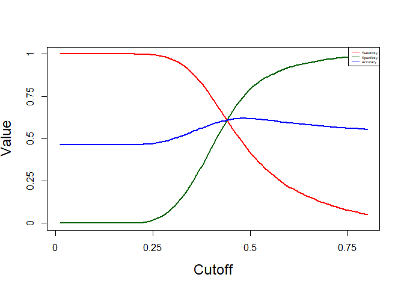
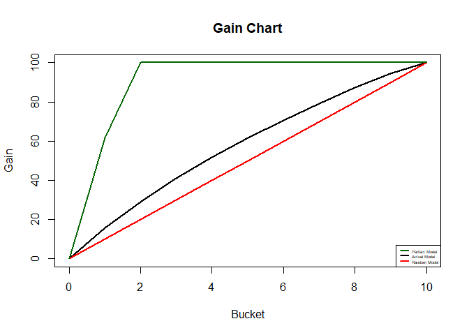
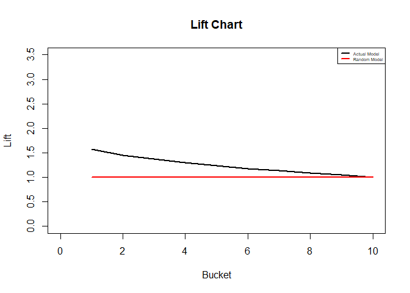

Risk Stratification
================

Risk stratification of diabetic patients for readmission

Logistic Regression

``` r
library(tidyverse)
```

    ## Warning: package 'tidyverse' was built under R version 3.5.2

``` r
library(ggplot2)
library(dplyr)
library(stringr)
library(caTools)
library(rpart)
library(caret)
library(car)
library(MASS)
```

Load the cleaned data

``` r
data <- read.csv("data/data_cleaned.csv", header=TRUE, 
                 na.strings = c("NA","na",""," ","?"), stringsAsFactors = FALSE)
```

``` r
# save the ID of patients
ID <- data$ID
# Remove the ID before analysis
data <- data[2:42]
```

``` r
# change readmitted to numeric column
table(data$readmitted)
```

    ## 
    ##    NO   YES 
    ## 53316 46176

``` r
data$readmitted <- as.factor(data$readmitted)
```

``` r
# splitting the data between train and test
set.seed(100)

indices = sample.split(data$readmitted, SplitRatio = 0.7)

train = data[indices,]

test = data[!(indices),]
```

### Logistic Regression

``` r
model_1 <- glm(readmitted ~ ., data = train, family = "binomial")
```

``` r
#Initial model summary
summary(model_1)
```

    ## 
    ## Call:
    ## glm(formula = readmitted ~ ., family = "binomial", data = train)
    ## 
    ## Deviance Residuals: 
    ##     Min       1Q   Median       3Q      Max  
    ## -3.8776  -1.0473  -0.7875   1.1854   2.0948  
    ## 
    ## Coefficients:
    ##                             Estimate Std. Error z value Pr(>|z|)    
    ## (Intercept)               -1.308e+00  2.682e-01  -4.875 1.09e-06 ***
    ## gender                     4.945e-02  1.623e-02   3.046 0.002320 ** 
    ## time_in_hospital           3.449e-02  9.697e-03   3.557 0.000375 ***
    ## num_lab_procedures         4.288e-02  9.271e-03   4.625 3.74e-06 ***
    ## num_procedures            -5.379e-02  9.056e-03  -5.939 2.86e-09 ***
    ## num_medications            2.023e-02  1.069e-02   1.892 0.058479 .  
    ## number_outpatient          9.453e-02  9.447e-03  10.006  < 2e-16 ***
    ## number_emergency           2.046e-01  1.417e-02  14.433  < 2e-16 ***
    ## number_inpatient           4.904e-01  1.099e-02  44.628  < 2e-16 ***
    ## number_diagnoses           1.827e-01  9.511e-03  19.213  < 2e-16 ***
    ## change                    -4.819e-02  2.216e-02  -2.175 0.029657 *  
    ## diabetesMed                2.687e-01  2.489e-02  10.794  < 2e-16 ***
    ## raceAsian                 -2.980e-01  1.024e-01  -2.910 0.003618 ** 
    ## raceCaucasian              1.904e-02  2.114e-02   0.901 0.367777    
    ## raceHispanic              -1.161e-01  5.904e-02  -1.967 0.049189 *  
    ## raceOther                 -2.517e-01  6.865e-02  -3.667 0.000246 ***
    ## age2                       8.271e-01  2.766e-01   2.990 0.002787 ** 
    ## age3                       7.099e-01  2.627e-01   2.703 0.006882 ** 
    ## age4                       7.671e-01  2.612e-01   2.936 0.003321 ** 
    ## age5                       8.787e-01  2.616e-01   3.359 0.000782 ***
    ## age6                       9.247e-01  2.616e-01   3.535 0.000408 ***
    ## age7                       8.675e-01  2.619e-01   3.313 0.000923 ***
    ## admission_type_id3        -1.638e-01  2.688e-02  -6.094 1.10e-09 ***
    ## admission_type_id4        -1.960e-01  7.507e-01  -0.261 0.793991    
    ## admission_type_id5         3.102e-01  3.648e-02   8.504  < 2e-16 ***
    ## admission_type_id7        -1.448e+01  3.604e+02  -0.040 0.967954    
    ## discharge_disposition_id2  5.169e-05  1.903e-02   0.003 0.997833    
    ## discharge_disposition_id3 -1.395e-01  3.699e-02  -3.770 0.000163 ***
    ## discharge_disposition_id4 -1.601e+01  4.130e+01  -0.388 0.698371    
    ## admission_source_id2       2.283e-02  2.274e-02   1.004 0.315522    
    ## admission_source_id3      -2.518e-01  4.433e-02  -5.679 1.35e-08 ***
    ## admission_source_id4      -1.511e+01  8.272e+02  -0.018 0.985428    
    ## A1Cresult.8                8.320e-02  4.988e-02   1.668 0.095283 .  
    ## A1CresultNone              1.293e-01  4.190e-02   3.084 0.002039 ** 
    ## A1CresultNorm             -5.748e-02  5.416e-02  -1.061 0.288489    
    ## insulinNo                 -1.049e-01  3.200e-02  -3.279 0.001042 ** 
    ## insulinSteady             -1.989e-01  2.968e-02  -6.701 2.06e-11 ***
    ## insulinUp                 -5.624e-02  3.344e-02  -1.682 0.092582 .  
    ## comorbidity1               2.130e-01  2.652e-02   8.031 9.70e-16 ***
    ## comorbidity2               1.819e-01  2.139e-02   8.501  < 2e-16 ***
    ## comorbidity3               2.889e-01  2.668e-02  10.828  < 2e-16 ***
    ## ---
    ## Signif. codes:  0 '***' 0.001 '**' 0.01 '*' 0.05 '.' 0.1 ' ' 1
    ## 
    ## (Dispersion parameter for binomial family taken to be 1)
    ## 
    ##     Null deviance: 96188  on 69643  degrees of freedom
    ## Residual deviance: 88997  on 69603  degrees of freedom
    ## AIC: 89079
    ## 
    ## Number of Fisher Scoring iterations: 14

Stepwise selection is used for modeling: stepAIC(model\_1, direction="both")

\# Redundant and correlated variables are removed with the help of p-value and vif values to reach significant variables and low vif values. This is the final model

``` r
model_16 <- glm(formula = readmitted ~ gender + time_in_hospital + num_lab_procedures + 
                  num_procedures + number_outpatient + number_emergency + number_inpatient + 
                  number_diagnoses + diabetesMed +
                  raceOther + age5 + age6 + admission_type_id3 + 
                  admission_type_id5 +
                  admission_source_id3 + 
                  A1CresultNone + insulinSteady + 
                  comorbidity1 + comorbidity2 + comorbidity3, family = "binomial", 
                data = train)
```

``` r
summary(model_16)
```

    ## 
    ## Call:
    ## glm(formula = readmitted ~ gender + time_in_hospital + num_lab_procedures + 
    ##     num_procedures + number_outpatient + number_emergency + number_inpatient + 
    ##     number_diagnoses + diabetesMed + raceOther + age5 + age6 + 
    ##     admission_type_id3 + admission_type_id5 + admission_source_id3 + 
    ##     A1CresultNone + insulinSteady + comorbidity1 + comorbidity2 + 
    ##     comorbidity3, family = "binomial", data = train)
    ## 
    ## Deviance Residuals: 
    ##     Min       1Q   Median       3Q      Max  
    ## -3.8241  -1.0439  -0.8247   1.2029   1.8422  
    ## 
    ## Coefficients:
    ##                       Estimate Std. Error z value Pr(>|z|)    
    ## (Intercept)          -0.644830   0.032374 -19.918  < 2e-16 ***
    ## gender                0.058613   0.015914   3.683 0.000230 ***
    ## time_in_hospital      0.048142   0.008657   5.561 2.68e-08 ***
    ## num_lab_procedures    0.033138   0.008892   3.727 0.000194 ***
    ## num_procedures       -0.065594   0.008402  -7.807 5.84e-15 ***
    ## number_outpatient     0.094861   0.009209  10.301  < 2e-16 ***
    ## number_emergency      0.199424   0.013815  14.435  < 2e-16 ***
    ## number_inpatient      0.467029   0.010596  44.075  < 2e-16 ***
    ## number_diagnoses      0.189992   0.009067  20.954  < 2e-16 ***
    ## diabetesMed           0.309105   0.020414  15.142  < 2e-16 ***
    ## raceOther            -0.256197   0.066088  -3.877 0.000106 ***
    ## age5                  0.082087   0.020287   4.046 5.20e-05 ***
    ## age6                  0.110401   0.019193   5.752 8.81e-09 ***
    ## admission_type_id3   -0.150461   0.021900  -6.870 6.40e-12 ***
    ## admission_type_id5    0.304362   0.035108   8.669  < 2e-16 ***
    ## admission_source_id3 -0.261607   0.042304  -6.184 6.25e-10 ***
    ## A1CresultNone         0.097085   0.022228   4.368 1.26e-05 ***
    ## insulinSteady        -0.130970   0.018455  -7.097 1.28e-12 ***
    ## comorbidity1          0.228236   0.025895   8.814  < 2e-16 ***
    ## comorbidity2          0.198403   0.020909   9.489  < 2e-16 ***
    ## comorbidity3          0.316445   0.026276  12.043  < 2e-16 ***
    ## ---
    ## Signif. codes:  0 '***' 0.001 '**' 0.01 '*' 0.05 '.' 0.1 ' ' 1
    ## 
    ## (Dispersion parameter for binomial family taken to be 1)
    ## 
    ##     Null deviance: 96188  on 69643  degrees of freedom
    ## Residual deviance: 90724  on 69623  degrees of freedom
    ## AIC: 90766
    ## 
    ## Number of Fisher Scoring iterations: 4

``` r
sort(vif(model_16))
```

    ##            raceOther               gender    number_outpatient 
    ##             1.001881             1.009186             1.031500 
    ##     number_emergency     number_inpatient        A1CresultNone 
    ##             1.053574             1.056132             1.104054 
    ##       num_procedures                 age5                 age6 
    ##             1.131038             1.136119             1.143113 
    ##   admission_type_id3        insulinSteady          diabetesMed 
    ##             1.147387             1.155037             1.164921 
    ##     time_in_hospital   num_lab_procedures     number_diagnoses 
    ##             1.208802             1.271439             1.278833 
    ##         comorbidity3         comorbidity1         comorbidity2 
    ##             1.629075             1.654840             1.687841 
    ##   admission_type_id5 admission_source_id3 
    ##             1.853042             1.860836

``` r
# Final Model With only significant variables in the model
final_model <- model_16
```

### Logistic regression - Model Evaluation

final\_model taken was model\_16 Predicted probabilities of readmitted for test data

``` r
test_pred = predict(final_model, type = "response", 
                     newdata = test)
```

``` r
summary(test_pred)
```

    ##    Min. 1st Qu.  Median    Mean 3rd Qu.    Max. 
    ##  0.1850  0.3718  0.4381  0.4637  0.5245  1.0000

Using the probability cutoff of 50% evaluate the predicted and true values

``` r
test_pred_readmitted <- factor(ifelse(test_pred >= 0.50, "YES", "NO"))
test_actual_readmitted <- factor(test$readmitted) 
test_conf <- confusionMatrix(test_pred_readmitted, test_actual_readmitted, positive = "YES")
test_conf
```

    ## Confusion Matrix and Statistics
    ## 
    ##           Reference
    ## Prediction    NO   YES
    ##        NO  12708  8101
    ##        YES  3287  5752
    ##                                          
    ##                Accuracy : 0.6185         
    ##                  95% CI : (0.6129, 0.624)
    ##     No Information Rate : 0.5359         
    ##     P-Value [Acc > NIR] : < 2.2e-16      
    ##                                          
    ##                   Kappa : 0.2147         
    ##  Mcnemar's Test P-Value : < 2.2e-16      
    ##                                          
    ##             Sensitivity : 0.4152         
    ##             Specificity : 0.7945         
    ##          Pos Pred Value : 0.6364         
    ##          Neg Pred Value : 0.6107         
    ##              Prevalence : 0.4641         
    ##          Detection Rate : 0.1927         
    ##    Detection Prevalence : 0.3028         
    ##       Balanced Accuracy : 0.6049         
    ##                                          
    ##        'Positive' Class : YES            
    ## 

Sensitivity is very low. So let's choose a different cutoff value

To find the optimal probalility cutoff, create a function to find the accuracy, sensitivity and specificity for a given cutoff

``` r
perform_fn <- function(cutoff) 
 {
   predicted_readmitted <- factor(ifelse(test_pred >= cutoff, "YES", "NO"))
   conf <- confusionMatrix(predicted_readmitted, test_actual_readmitted, positive = "YES")
   acc <- conf$overall[1]
   sens <- conf$byClass[1]
   spec <- conf$byClass[2]
   out <- t(as.matrix(c(sens, spec, acc))) 
   colnames(out) <- c("sensitivity", "specificity", "accuracy")
   return(out)
 }
# Creating cutoff values from 0.01 to 0.80 for plotting and initiallizing a matrix of 100 X 3.
s = seq(.01,.80,length=100)
OUT = matrix(0,100,3)
for(i in 1:100)
 {
   OUT[i,] = perform_fn(s[i])
 } 
 
plot(s, OUT[,1],xlab="Cutoff",ylab="Value",cex.lab=1.5,cex.axis=1.5,ylim=c(0,1),type="l",lwd=2,axes=FALSE,col=2)
axis(1,seq(0,1,length=5),seq(0,1,length=5),cex.lab=1.5)
axis(2,seq(0,1,length=5),seq(0,1,length=5),cex.lab=1.5)
lines(s,OUT[,2],col="darkgreen",lwd=2)
lines(s,OUT[,3],col=4,lwd=2)
box()
legend("topright",col=c(2,"darkgreen",4,"darkred"),
        lwd=c(1,1,1,1),c("Sensitivity","Specificity","Accuracy"), cex=0.4)
```



``` r
cutoff <- s[which(abs(OUT[,1]-OUT[,2])<0.01)]
cutoff
```

    ## [1] 0.4409091

``` r
# Let's choose a cutoff value of 0.42 for final model
 
 test_cutoff_readmitted <- factor(ifelse(test_pred >= cutoff, "YES", "NO"))
 
 conf_final <- confusionMatrix(test_cutoff_readmitted, test_actual_readmitted, positive = "YES")
 
 acc <- conf_final$overall[1]
 
 sens <- conf_final$byClass[1]
 
 spec <- conf_final$byClass[2]
 
 acc
```

    ##  Accuracy 
    ## 0.6094881

``` r
 sens
```

    ## Sensitivity 
    ##   0.6059337

``` r
 spec
```

    ## Specificity 
    ##   0.6125664

``` r
test_cutoff_readmitted <- ifelse(test_cutoff_readmitted=="YES",1,0)
test_actual_readmitted <- ifelse(test_actual_readmitted=="YES",1,0)
```

Exporting Data for Excel Analysis (KS, Gain, Lift etc)

``` r
myeval <- matrix(nrow = length(test_pred),ncol = 2)
myeval[,1] <- test_pred
myeval[,2] <- test_actual_readmitted
colnames(myeval) <- c("Predicted_Prob","Actual_Labels")
```

KS -statistic - Test Data

``` r
# on testing  data
pred_object_test<- prediction(test_cutoff_readmitted, test_actual_readmitted)
performance_measures_test<- performance(pred_object_test, "tpr", "fpr")
ks_table_test <- attr(performance_measures_test, "y.values")[[1]] - 
   (attr(performance_measures_test, "x.values")[[1]])
max(ks_table_test)
```

    ## [1] 0.2185002

Lift & Gain Chart

``` r
readmitted_decile = lift(test_actual_readmitted, test_pred, groups = 10)
readmitted_decile
```

    ## # A tibble: 10 x 6
    ##    bucket total totalresp Cumresp  Gain Cumlift
    ##     <int> <int>     <dbl>   <dbl> <dbl>   <dbl>
    ##  1      1  2985      2180    2180  15.7    1.57
    ##  2      2  2985      1852    4032  29.1    1.46
    ##  3      3  2985      1671    5703  41.2    1.37
    ##  4      4  2985      1480    7183  51.9    1.30
    ##  5      5  2984      1354    8537  61.6    1.23
    ##  6      6  2985      1267    9804  70.8    1.18
    ##  7      7  2985      1186   10990  79.3    1.13
    ##  8      8  2985      1120   12110  87.4    1.09
    ##  9      9  2985       982   13092  94.5    1.05
    ## 10     10  2984       761   13853 100      1

Gain chart

``` r
Gain <- c(0,readmitted_decile$Gain)
Deciles <- c(0,readmitted_decile$bucket)
plot(y=Gain,x=Deciles,type ="l",lwd = 2,xlab="Bucket",ylab="Gain",main = "Gain Chart")

Random_Gain <- seq(from=0,to=100,by=10)
lines(y=Random_Gain,x=Deciles,type ="l",lwd = 2, col="red")
 
Perfect_Gain <- vector(mode = "numeric", length = 11)
for (i in 2:11){Perfect_Gain[i] <- 100*min(1,129*(i-1)/209)}
lines(y=Perfect_Gain,x=Deciles,type ="l",lwd = 2, col="darkgreen")
legend("bottomright",col=c("darkgreen","black","red"),
       lwd =c(2,2,2,2),c("Perfect Model","Actual Model","Random Model"), cex = 0.4)
```



Lift chart

``` r
Lift <- Gain/Random_Gain
Random_Lift <- Random_Gain/Random_Gain
 
plot(y=Lift,x=Deciles,type ="l",ylim=c(0,3.5),lwd = 2,xlab="Bucket",ylab="Lift",main = "Lift Chart",ylim<-c())
lines(y=Random_Lift,x=Deciles,type ="l",lwd = 2, col="red")
legend("topright",col=c("black","red"),lwd =c(2,2,2),c("Actual Model","Random Model"), cex = 0.45)
```


