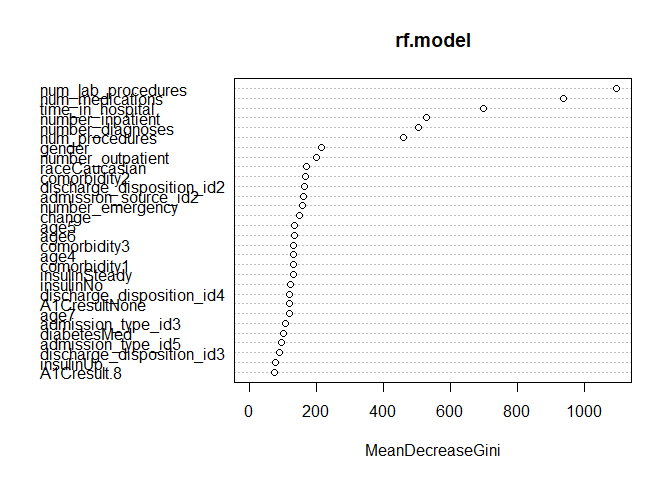
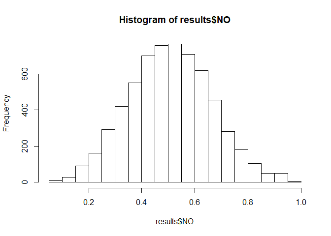
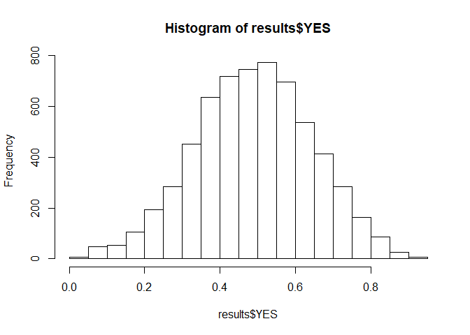
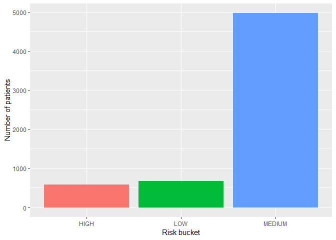

Risk Stratification
================

Risk stratification of diabetes patients with random forest

``` r
# Load the cleaned data
data <- read.csv("data/data_cleaned.csv", header=TRUE, 
                 na.strings = c("NA","na",""," ","?"), stringsAsFactors = FALSE)
# save the ID of patients
ID <- data$ID
# Remove the ID before analysis
data <- data[2:42]
table(data$readmitted)
```

    ## 
    ##    NO   YES 
    ## 53316 46176

``` r
data$readmitted <- as.factor(data$readmitted)
```

``` r
# sampling down the data
set.seed(123)
data_rf <- data[sample(nrow(data), nrow(data)*0.25, replace = F),]

set.seed(123)
indices <- sample(2, nrow(data_rf), replace = T, prob = c(0.75, 0.25))
train <- data_rf[indices == 1, ]
test <- data_rf[indices == 2, ]
```

``` r
set.seed(123)
rf.model <- randomForest(readmitted ~ ., data = train, do.trace = T)
```

    ## ntree      OOB      1      2
    ##     1:  44.50% 40.17% 49.41%
    ##     2:  45.20% 40.07% 51.04%
    ##     3:  44.84% 38.59% 52.00%
    ##     4:  44.82% 38.14% 52.46%
    ##     5:  44.76% 37.60% 53.00%
    ##     6:  44.73% 37.33% 53.19%
    ##     7:  44.57% 37.06% 53.12%
    ##     8:  44.32% 36.40% 53.37%
    ##     9:  44.14% 36.49% 52.91%
    ##    10:  44.22% 36.59% 52.98%
    ##    11:  43.89% 36.09% 52.84%
    ##    12:  43.50% 35.69% 52.48%
    ##    13:  43.36% 35.42% 52.48%
    ##    14:  42.82% 34.74% 52.13%
    ##    15:  42.32% 33.95% 51.95%
    ##    16:  42.45% 34.01% 52.15%
    ##    17:  42.11% 33.70% 51.78%
    ##    18:  42.14% 33.81% 51.72%
    ##    19:  42.01% 33.46% 51.84%
    ##    20:  41.74% 33.13% 51.66%
    ##    21:  41.83% 33.03% 51.97%
    ##    22:  41.40% 32.65% 51.48%
    ##    23:  41.31% 32.63% 51.30%
    ##    24:  41.26% 32.64% 51.19%
    ##    25:  41.12% 32.48% 51.06%
    ##    26:  41.07% 32.57% 50.85%
    ##    27:  40.65% 31.90% 50.72%
    ##    28:  40.90% 32.14% 50.98%
    ##    29:  40.73% 32.04% 50.74%
    ##    30:  40.61% 31.87% 50.66%
    ##    31:  40.32% 31.59% 50.36%
    ##    32:  40.38% 31.72% 50.33%
    ##    33:  40.35% 31.69% 50.31%
    ##    34:  40.33% 31.53% 50.45%
    ##    35:  40.35% 31.47% 50.58%
    ##    36:  40.28% 31.54% 50.35%
    ##    37:  40.19% 31.37% 50.33%
    ##    38:  40.08% 31.48% 49.98%
    ##    39:  40.22% 31.65% 50.08%
    ##    40:  40.11% 31.68% 49.82%
    ##    41:  39.97% 31.23% 50.03%
    ##    42:  40.05% 31.45% 49.95%
    ##    43:  40.19% 31.62% 50.05%
    ##    44:  40.03% 31.50% 49.85%
    ##    45:  39.89% 31.29% 49.78%
    ##    46:  39.94% 31.30% 49.87%
    ##    47:  40.09% 31.45% 50.03%
    ##    48:  39.81% 30.93% 50.02%
    ##    49:  39.77% 30.89% 50.00%
    ##    50:  39.87% 31.11% 49.94%
    ##    51:  39.79% 30.90% 50.02%
    ##    52:  39.88% 30.91% 50.20%
    ##    53:  39.79% 30.73% 50.21%
    ##    54:  39.82% 30.96% 50.01%
    ##    55:  39.84% 30.97% 50.05%
    ##    56:  39.67% 30.92% 49.75%
    ##    57:  39.91% 31.18% 49.97%
    ##    58:  39.94% 31.12% 50.09%
    ##    59:  39.80% 31.25% 49.64%
    ##    60:  39.81% 30.95% 50.01%
    ##    61:  39.92% 31.16% 50.01%
    ##    62:  39.67% 31.01% 49.63%
    ##    63:  39.78% 30.94% 49.95%
    ##    64:  39.73% 30.94% 49.84%
    ##    65:  39.77% 30.97% 49.90%
    ##    66:  39.77% 30.93% 49.94%
    ##    67:  39.55% 30.73% 49.71%
    ##    68:  39.45% 30.62% 49.62%
    ##    69:  39.40% 30.49% 49.67%
    ##    70:  39.49% 30.56% 49.77%
    ##    71:  39.55% 30.60% 49.85%
    ##    72:  39.50% 30.48% 49.87%
    ##    73:  39.31% 30.35% 49.63%
    ##    74:  39.21% 30.30% 49.46%
    ##    75:  39.31% 30.31% 49.67%
    ##    76:  39.25% 30.22% 49.65%
    ##    77:  39.41% 30.34% 49.85%
    ##    78:  39.28% 30.23% 49.70%
    ##    79:  39.34% 30.35% 49.69%
    ##    80:  39.32% 30.17% 49.85%
    ##    81:  39.43% 30.43% 49.78%
    ##    82:  39.45% 30.32% 49.95%
    ##    83:  39.25% 30.15% 49.72%
    ##    84:  39.12% 29.87% 49.76%
    ##    85:  39.16% 30.10% 49.60%
    ##    86:  39.20% 30.03% 49.76%
    ##    87:  39.18% 30.02% 49.72%
    ##    88:  39.36% 30.22% 49.87%
    ##    89:  39.27% 29.99% 49.94%
    ##    90:  39.15% 29.87% 49.84%
    ##    91:  39.16% 30.08% 49.62%
    ##    92:  39.14% 29.81% 49.88%
    ##    93:  39.36% 30.13% 49.98%
    ##    94:  39.24% 30.05% 49.82%
    ##    95:  39.30% 30.06% 49.94%
    ##    96:  39.44% 30.17% 50.10%
    ##    97:  39.31% 30.11% 49.90%
    ##    98:  39.15% 29.95% 49.73%
    ##    99:  39.21% 29.94% 49.87%
    ##   100:  39.28% 30.00% 49.97%
    ##   101:  39.20% 30.00% 49.78%
    ##   102:  39.30% 30.10% 49.88%
    ##   103:  39.14% 30.02% 49.63%
    ##   104:  39.07% 29.91% 49.62%
    ##   105:  39.09% 29.94% 49.63%
    ##   106:  38.94% 29.97% 49.26%
    ##   107:  38.80% 29.70% 49.27%
    ##   108:  38.91% 30.01% 49.16%
    ##   109:  38.98% 29.96% 49.35%
    ##   110:  38.92% 29.98% 49.22%
    ##   111:  38.99% 29.88% 49.47%
    ##   112:  39.05% 30.06% 49.39%
    ##   113:  39.07% 29.94% 49.57%
    ##   114:  38.90% 29.81% 49.37%
    ##   115:  39.01% 29.78% 49.63%
    ##   116:  39.05% 29.88% 49.60%
    ##   117:  38.94% 30.11% 49.11%
    ##   118:  38.90% 29.93% 49.23%
    ##   119:  38.79% 29.92% 49.01%
    ##   120:  38.72% 29.72% 49.08%
    ##   121:  38.79% 29.82% 49.11%
    ##   122:  38.86% 29.93% 49.13%
    ##   123:  38.71% 29.80% 48.97%
    ##   124:  38.69% 29.79% 48.93%
    ##   125:  38.66% 29.74% 48.93%
    ##   126:  38.72% 29.78% 49.02%
    ##   127:  38.70% 29.78% 48.96%
    ##   128:  38.69% 29.82% 48.90%
    ##   129:  38.64% 29.82% 48.80%
    ##   130:  38.84% 29.74% 49.31%
    ##   131:  38.87% 29.85% 49.26%
    ##   132:  38.74% 29.70% 49.15%
    ##   133:  38.72% 29.74% 49.07%
    ##   134:  38.76% 29.73% 49.15%
    ##   135:  38.78% 29.78% 49.13%
    ##   136:  38.66% 29.68% 49.01%
    ##   137:  38.81% 29.84% 49.13%
    ##   138:  38.65% 29.72% 48.94%
    ##   139:  38.80% 29.67% 49.32%
    ##   140:  38.79% 29.69% 49.26%
    ##   141:  38.78% 29.65% 49.28%
    ##   142:  38.72% 29.71% 49.09%
    ##   143:  38.66% 29.62% 49.07%
    ##   144:  38.66% 29.58% 49.12%
    ##   145:  38.62% 29.63% 48.97%
    ##   146:  38.66% 29.62% 49.07%
    ##   147:  38.75% 29.72% 49.15%
    ##   148:  38.69% 29.67% 49.08%
    ##   149:  38.69% 29.56% 49.19%
    ##   150:  38.69% 29.55% 49.20%
    ##   151:  38.62% 29.61% 48.99%
    ##   152:  38.71% 29.69% 49.10%
    ##   153:  38.69% 29.53% 49.24%
    ##   154:  38.61% 29.49% 49.11%
    ##   155:  38.71% 29.54% 49.26%
    ##   156:  38.64% 29.53% 49.13%
    ##   157:  38.67% 29.53% 49.19%
    ##   158:  38.76% 29.65% 49.24%
    ##   159:  38.78% 29.74% 49.18%
    ##   160:  38.72% 29.65% 49.17%
    ##   161:  38.65% 29.58% 49.10%
    ##   162:  38.61% 29.56% 49.02%
    ##   163:  38.63% 29.54% 49.09%
    ##   164:  38.68% 29.47% 49.27%
    ##   165:  38.70% 29.47% 49.33%
    ##   166:  38.78% 29.57% 49.38%
    ##   167:  38.75% 29.58% 49.30%
    ##   168:  38.79% 29.64% 49.32%
    ##   169:  38.82% 29.68% 49.34%
    ##   170:  38.84% 29.60% 49.47%
    ##   171:  38.86% 29.70% 49.41%
    ##   172:  38.80% 29.55% 49.46%
    ##   173:  38.75% 29.64% 49.24%
    ##   174:  38.80% 29.63% 49.35%
    ##   175:  38.72% 29.51% 49.33%
    ##   176:  38.83% 29.61% 49.45%
    ##   177:  38.79% 29.50% 49.48%
    ##   178:  38.79% 29.44% 49.55%
    ##   179:  38.88% 29.62% 49.54%
    ##   180:  38.76% 29.50% 49.41%
    ##   181:  38.84% 29.61% 49.46%
    ##   182:  38.80% 29.63% 49.35%
    ##   183:  38.94% 29.79% 49.47%
    ##   184:  38.82% 29.60% 49.42%
    ##   185:  38.81% 29.66% 49.34%
    ##   186:  38.82% 29.60% 49.43%
    ##   187:  38.72% 29.64% 49.18%
    ##   188:  38.75% 29.62% 49.26%
    ##   189:  38.73% 29.58% 49.26%
    ##   190:  38.76% 29.69% 49.19%
    ##   191:  38.73% 29.61% 49.24%
    ##   192:  38.73% 29.60% 49.25%
    ##   193:  38.76% 29.55% 49.35%
    ##   194:  38.70% 29.66% 49.11%
    ##   195:  38.73% 29.54% 49.31%
    ##   196:  38.64% 29.55% 49.11%
    ##   197:  38.61% 29.54% 49.05%
    ##   198:  38.70% 29.60% 49.18%
    ##   199:  38.79% 29.64% 49.32%
    ##   200:  38.68% 29.58% 49.16%
    ##   201:  38.79% 29.62% 49.35%
    ##   202:  38.77% 29.67% 49.24%
    ##   203:  38.71% 29.74% 49.04%
    ##   204:  38.82% 29.61% 49.41%
    ##   205:  38.76% 29.59% 49.31%
    ##   206:  38.71% 29.49% 49.33%
    ##   207:  38.80% 29.61% 49.39%
    ##   208:  38.81% 29.63% 49.38%
    ##   209:  38.83% 29.59% 49.47%
    ##   210:  38.78% 29.56% 49.39%
    ##   211:  38.71% 29.44% 49.38%
    ##   212:  38.86% 29.61% 49.52%
    ##   213:  38.79% 29.50% 49.49%
    ##   214:  38.82% 29.51% 49.54%
    ##   215:  38.71% 29.48% 49.33%
    ##   216:  38.77% 29.44% 49.50%
    ##   217:  38.71% 29.39% 49.45%
    ##   218:  38.67% 29.47% 49.26%
    ##   219:  38.72% 29.51% 49.32%
    ##   220:  38.61% 29.31% 49.32%
    ##   221:  38.72% 29.53% 49.30%
    ##   222:  38.68% 29.42% 49.34%
    ##   223:  38.63% 29.40% 49.26%
    ##   224:  38.63% 29.34% 49.33%
    ##   225:  38.52% 29.18% 49.27%
    ##   226:  38.49% 29.17% 49.23%
    ##   227:  38.59% 29.20% 49.40%
    ##   228:  38.56% 29.19% 49.35%
    ##   229:  38.59% 29.18% 49.42%
    ##   230:  38.55% 29.18% 49.34%
    ##   231:  38.55% 29.22% 49.30%
    ##   232:  38.60% 29.24% 49.37%
    ##   233:  38.60% 29.25% 49.35%
    ##   234:  38.69% 29.30% 49.50%
    ##   235:  38.66% 29.39% 49.33%
    ##   236:  38.60% 29.29% 49.32%
    ##   237:  38.67% 29.35% 49.40%
    ##   238:  38.65% 29.33% 49.39%
    ##   239:  38.63% 29.27% 49.40%
    ##   240:  38.61% 29.27% 49.37%
    ##   241:  38.63% 29.22% 49.47%
    ##   242:  38.62% 29.28% 49.37%
    ##   243:  38.55% 29.14% 49.38%
    ##   244:  38.61% 29.24% 49.39%
    ##   245:  38.55% 29.17% 49.35%
    ##   246:  38.66% 29.24% 49.50%
    ##   247:  38.54% 29.19% 49.30%
    ##   248:  38.56% 29.18% 49.37%
    ##   249:  38.59% 29.21% 49.39%
    ##   250:  38.49% 29.11% 49.28%
    ##   251:  38.51% 29.04% 49.42%
    ##   252:  38.53% 29.11% 49.38%
    ##   253:  38.57% 29.12% 49.45%
    ##   254:  38.48% 29.07% 49.32%
    ##   255:  38.58% 29.08% 49.53%
    ##   256:  38.61% 29.10% 49.56%
    ##   257:  38.58% 29.02% 49.60%
    ##   258:  38.70% 29.15% 49.70%
    ##   259:  38.65% 29.15% 49.60%
    ##   260:  38.63% 29.19% 49.49%
    ##   261:  38.64% 29.22% 49.48%
    ##   262:  38.65% 29.11% 49.63%
    ##   263:  38.70% 29.21% 49.63%
    ##   264:  38.62% 29.16% 49.50%
    ##   265:  38.60% 29.10% 49.54%
    ##   266:  38.64% 29.15% 49.57%
    ##   267:  38.60% 29.02% 49.63%
    ##   268:  38.66% 29.24% 49.52%
    ##   269:  38.64% 29.15% 49.56%
    ##   270:  38.57% 29.01% 49.58%
    ##   271:  38.58% 29.11% 49.48%
    ##   272:  38.60% 29.11% 49.53%
    ##   273:  38.64% 29.10% 49.62%
    ##   274:  38.59% 29.14% 49.47%
    ##   275:  38.57% 29.13% 49.43%
    ##   276:  38.58% 29.08% 49.52%
    ##   277:  38.64% 29.17% 49.54%
    ##   278:  38.57% 29.20% 49.35%
    ##   279:  38.66% 29.20% 49.56%
    ##   280:  38.56% 29.11% 49.43%
    ##   281:  38.65% 29.28% 49.45%
    ##   282:  38.63% 29.26% 49.42%
    ##   283:  38.60% 29.31% 49.28%
    ##   284:  38.58% 29.23% 49.35%
    ##   285:  38.54% 29.24% 49.24%
    ##   286:  38.58% 29.19% 49.39%
    ##   287:  38.49% 29.13% 49.27%
    ##   288:  38.46% 29.18% 49.15%
    ##   289:  38.47% 29.07% 49.30%
    ##   290:  38.61% 29.28% 49.34%
    ##   291:  38.55% 29.25% 49.26%
    ##   292:  38.52% 29.20% 49.25%
    ##   293:  38.56% 29.15% 49.40%
    ##   294:  38.62% 29.28% 49.37%
    ##   295:  38.55% 29.21% 49.30%
    ##   296:  38.49% 29.14% 49.26%
    ##   297:  38.55% 29.15% 49.38%
    ##   298:  38.52% 29.19% 49.26%
    ##   299:  38.50% 29.12% 49.30%
    ##   300:  38.47% 29.04% 49.33%
    ##   301:  38.46% 29.11% 49.23%
    ##   302:  38.47% 29.04% 49.32%
    ##   303:  38.40% 29.02% 49.20%
    ##   304:  38.47% 29.13% 49.22%
    ##   305:  38.48% 29.07% 49.31%
    ##   306:  38.47% 29.09% 49.27%
    ##   307:  38.55% 29.09% 49.45%
    ##   308:  38.42% 28.95% 49.32%
    ##   309:  38.54% 29.08% 49.42%
    ##   310:  38.49% 29.05% 49.35%
    ##   311:  38.58% 29.13% 49.46%
    ##   312:  38.56% 29.15% 49.39%
    ##   313:  38.54% 29.15% 49.34%
    ##   314:  38.48% 29.06% 49.33%
    ##   315:  38.55% 29.17% 49.34%
    ##   316:  38.50% 29.09% 49.33%
    ##   317:  38.45% 29.07% 49.24%
    ##   318:  38.48% 29.12% 49.26%
    ##   319:  38.46% 29.08% 49.25%
    ##   320:  38.57% 29.13% 49.43%
    ##   321:  38.51% 29.05% 49.41%
    ##   322:  38.53% 29.07% 49.42%
    ##   323:  38.54% 29.18% 49.32%
    ##   324:  38.56% 29.08% 49.48%
    ##   325:  38.54% 29.00% 49.53%
    ##   326:  38.54% 29.07% 49.45%
    ##   327:  38.56% 29.12% 49.42%
    ##   328:  38.50% 29.03% 49.40%
    ##   329:  38.63% 29.16% 49.53%
    ##   330:  38.58% 29.08% 49.52%
    ##   331:  38.62% 29.16% 49.52%
    ##   332:  38.60% 29.12% 49.50%
    ##   333:  38.66% 29.22% 49.53%
    ##   334:  38.61% 29.16% 49.48%
    ##   335:  38.41% 28.89% 49.38%
    ##   336:  38.47% 28.99% 49.38%
    ##   337:  38.46% 28.99% 49.35%
    ##   338:  38.45% 29.00% 49.33%
    ##   339:  38.39% 28.91% 49.31%
    ##   340:  38.50% 29.01% 49.43%
    ##   341:  38.40% 28.94% 49.28%
    ##   342:  38.35% 28.83% 49.31%
    ##   343:  38.56% 29.08% 49.48%
    ##   344:  38.52% 29.06% 49.41%
    ##   345:  38.49% 28.92% 49.52%
    ##   346:  38.54% 28.99% 49.54%
    ##   347:  38.51% 28.97% 49.49%
    ##   348:  38.50% 28.95% 49.50%
    ##   349:  38.40% 28.80% 49.46%
    ##   350:  38.40% 28.83% 49.42%
    ##   351:  38.44% 28.89% 49.43%
    ##   352:  38.44% 28.93% 49.39%
    ##   353:  38.48% 28.89% 49.53%
    ##   354:  38.48% 28.98% 49.41%
    ##   355:  38.42% 28.94% 49.33%
    ##   356:  38.44% 28.97% 49.34%
    ##   357:  38.37% 28.84% 49.34%
    ##   358:  38.34% 28.84% 49.28%
    ##   359:  38.42% 28.90% 49.38%
    ##   360:  38.42% 28.89% 49.39%
    ##   361:  38.46% 28.97% 49.38%
    ##   362:  38.46% 28.94% 49.42%
    ##   363:  38.46% 28.90% 49.47%
    ##   364:  38.51% 29.00% 49.47%
    ##   365:  38.41% 28.85% 49.41%
    ##   366:  38.45% 28.98% 49.35%
    ##   367:  38.41% 28.87% 49.39%
    ##   368:  38.33% 28.78% 49.33%
    ##   369:  38.32% 28.84% 49.23%
    ##   370:  38.37% 28.80% 49.39%
    ##   371:  38.47% 28.99% 49.39%
    ##   372:  38.42% 28.93% 49.35%
    ##   373:  38.41% 28.86% 49.40%
    ##   374:  38.46% 28.86% 49.52%
    ##   375:  38.45% 28.94% 49.39%
    ##   376:  38.45% 28.90% 49.43%
    ##   377:  38.50% 28.95% 49.49%
    ##   378:  38.42% 28.87% 49.41%
    ##   379:  38.38% 28.85% 49.34%
    ##   380:  38.36% 28.81% 49.37%
    ##   381:  38.42% 28.87% 49.41%
    ##   382:  38.42% 28.97% 49.31%
    ##   383:  38.45% 29.00% 49.33%
    ##   384:  38.45% 28.96% 49.38%
    ##   385:  38.36% 28.87% 49.30%
    ##   386:  38.38% 28.85% 49.34%
    ##   387:  38.35% 28.90% 49.23%
    ##   388:  38.30% 28.79% 49.25%
    ##   389:  38.35% 28.91% 49.22%
    ##   390:  38.33% 28.79% 49.31%
    ##   391:  38.32% 28.81% 49.26%
    ##   392:  38.35% 28.80% 49.35%
    ##   393:  38.36% 28.86% 49.30%
    ##   394:  38.27% 28.73% 49.25%
    ##   395:  38.27% 28.67% 49.33%
    ##   396:  38.29% 28.72% 49.31%
    ##   397:  38.30% 28.73% 49.32%
    ##   398:  38.32% 28.83% 49.24%
    ##   399:  38.38% 28.82% 49.38%
    ##   400:  38.25% 28.66% 49.28%
    ##   401:  38.33% 28.72% 49.40%
    ##   402:  38.34% 28.76% 49.37%
    ##   403:  38.32% 28.77% 49.32%
    ##   404:  38.34% 28.85% 49.27%
    ##   405:  38.39% 28.86% 49.35%
    ##   406:  38.34% 28.90% 49.22%
    ##   407:  38.32% 28.80% 49.27%
    ##   408:  38.35% 28.84% 49.30%
    ##   409:  38.39% 28.85% 49.37%
    ##   410:  38.32% 28.86% 49.22%
    ##   411:  38.27% 28.79% 49.19%
    ##   412:  38.25% 28.67% 49.28%
    ##   413:  38.22% 28.67% 49.22%
    ##   414:  38.20% 28.65% 49.19%
    ##   415:  38.23% 28.68% 49.22%
    ##   416:  38.24% 28.70% 49.23%
    ##   417:  38.22% 28.72% 49.16%
    ##   418:  38.27% 28.81% 49.16%
    ##   419:  38.23% 28.72% 49.17%
    ##   420:  38.27% 28.75% 49.24%
    ##   421:  38.25% 28.73% 49.20%
    ##   422:  38.26% 28.72% 49.25%
    ##   423:  38.23% 28.71% 49.19%
    ##   424:  38.25% 28.65% 49.30%
    ##   425:  38.21% 28.68% 49.19%
    ##   426:  38.27% 28.77% 49.22%
    ##   427:  38.27% 28.86% 49.10%
    ##   428:  38.25% 28.69% 49.25%
    ##   429:  38.23% 28.70% 49.20%
    ##   430:  38.17% 28.66% 49.12%
    ##   431:  38.17% 28.68% 49.10%
    ##   432:  38.19% 28.69% 49.13%
    ##   433:  38.17% 28.68% 49.09%
    ##   434:  38.20% 28.63% 49.23%
    ##   435:  38.27% 28.67% 49.32%
    ##   436:  38.27% 28.69% 49.30%
    ##   437:  38.23% 28.71% 49.19%
    ##   438:  38.24% 28.62% 49.31%
    ##   439:  38.20% 28.62% 49.24%
    ##   440:  38.21% 28.56% 49.32%
    ##   441:  38.26% 28.68% 49.28%
    ##   442:  38.29% 28.71% 49.32%
    ##   443:  38.29% 28.71% 49.32%
    ##   444:  38.31% 28.73% 49.33%
    ##   445:  38.36% 28.74% 49.45%
    ##   446:  38.32% 28.66% 49.45%
    ##   447:  38.33% 28.72% 49.40%
    ##   448:  38.24% 28.59% 49.35%
    ##   449:  38.36% 28.68% 49.50%
    ##   450:  38.36% 28.74% 49.43%
    ##   451:  38.29% 28.61% 49.43%
    ##   452:  38.29% 28.73% 49.30%
    ##   453:  38.24% 28.60% 49.34%
    ##   454:  38.25% 28.60% 49.35%
    ##   455:  38.28% 28.57% 49.47%
    ##   456:  38.21% 28.55% 49.33%
    ##   457:  38.26% 28.58% 49.40%
    ##   458:  38.23% 28.63% 49.28%
    ##   459:  38.18% 28.61% 49.20%
    ##   460:  38.25% 28.59% 49.37%
    ##   461:  38.17% 28.47% 49.34%
    ##   462:  38.23% 28.51% 49.42%
    ##   463:  38.28% 28.69% 49.32%
    ##   464:  38.26% 28.55% 49.45%
    ##   465:  38.23% 28.54% 49.38%
    ##   466:  38.27% 28.59% 49.42%
    ##   467:  38.12% 28.41% 49.30%
    ##   468:  38.15% 28.43% 49.34%
    ##   469:  38.16% 28.52% 49.25%
    ##   470:  38.16% 28.44% 49.35%
    ##   471:  38.19% 28.53% 49.32%
    ##   472:  38.23% 28.53% 49.39%
    ##   473:  38.18% 28.52% 49.31%
    ##   474:  38.19% 28.55% 49.30%
    ##   475:  38.18% 28.57% 49.25%
    ##   476:  38.20% 28.58% 49.27%
    ##   477:  38.24% 28.57% 49.38%
    ##   478:  38.19% 28.57% 49.26%
    ##   479:  38.19% 28.54% 49.31%
    ##   480:  38.25% 28.56% 49.40%
    ##   481:  38.21% 28.60% 49.27%
    ##   482:  38.29% 28.61% 49.45%
    ##   483:  38.29% 28.60% 49.46%
    ##   484:  38.24% 28.57% 49.37%
    ##   485:  38.32% 28.67% 49.43%
    ##   486:  38.20% 28.55% 49.31%
    ##   487:  38.19% 28.51% 49.34%
    ##   488:  38.23% 28.56% 49.37%
    ##   489:  38.24% 28.57% 49.37%
    ##   490:  38.24% 28.60% 49.34%
    ##   491:  38.26% 28.58% 49.40%
    ##   492:  38.25% 28.50% 49.47%
    ##   493:  38.26% 28.56% 49.43%
    ##   494:  38.32% 28.53% 49.60%
    ##   495:  38.27% 28.54% 49.48%
    ##   496:  38.24% 28.54% 49.40%
    ##   497:  38.21% 28.53% 49.35%
    ##   498:  38.29% 28.65% 49.40%
    ##   499:  38.21% 28.56% 49.33%
    ##   500:  38.23% 28.58% 49.33%

``` r
rf.predict <- predict(rf.model, test[,-1], type = "class")
confusionMatrix(rf.predict, test$readmitted)
```

    ## Confusion Matrix and Statistics
    ## 
    ##           Reference
    ## Prediction   NO  YES
    ##        NO  2138 1093
    ##        YES 1249 1743
    ##                                           
    ##                Accuracy : 0.6237          
    ##                  95% CI : (0.6115, 0.6357)
    ##     No Information Rate : 0.5443          
    ##     P-Value [Acc > NIR] : < 2.2e-16       
    ##                                           
    ##                   Kappa : 0.2447          
    ##  Mcnemar's Test P-Value : 0.001361        
    ##                                           
    ##             Sensitivity : 0.6312          
    ##             Specificity : 0.6146          
    ##          Pos Pred Value : 0.6617          
    ##          Neg Pred Value : 0.5826          
    ##              Prevalence : 0.5443          
    ##          Detection Rate : 0.3436          
    ##    Detection Prevalence : 0.5192          
    ##       Balanced Accuracy : 0.6229          
    ##                                           
    ##        'Positive' Class : NO              
    ## 

Random forest gives better accuracy. Find out the optimal probability cutoff. Create a function to find the accuracy, sensitivity and specificity for a given cutoff.

``` r
rf_predict <- data.frame(predict(rf.model, test[,-1], type = "prob"))
predicted_readmission <- factor(ifelse(rf_predict$YES >= 0.5, "YES", "NO"))
perform_fn <- function(cutoff) 
{
  predicted_readmission <- factor(ifelse(rf_predict$YES >= cutoff, "YES", "NO"))
  conf <- confusionMatrix(predicted_readmission, test$readmitted, positive = "YES")
  acc <- conf$overall[1]
  sens <- conf$byClass[1]
  spec <- conf$byClass[2]
  out <- t(as.matrix(c(sens, spec, acc))) 
  colnames(out) <- c("sensitivity", "specificity", "accuracy")
  return(out)
}
summary(rf_predict$YES)
```

    ##    Min. 1st Qu.  Median    Mean 3rd Qu.    Max. 
    ##  0.0400  0.3860  0.4920  0.4905  0.5980  0.9280

``` r
summary(rf_predict$NO)
```

    ##    Min. 1st Qu.  Median    Mean 3rd Qu.    Max. 
    ##  0.0720  0.4020  0.5080  0.5095  0.6140  0.9600

``` r
# Creating cutoff values from 0.01 to 0.95 for plotting and initiallizing a matrix of 100 X 3.
s = seq(.01,.95,length=100)
OUT = matrix(0,100,3)
for(i in 1:100){
  OUT[i,] = perform_fn(s[i])
} 
```

    ## Warning in confusionMatrix.default(predicted_readmission,
    ## test$readmitted, : Levels are not in the same order for reference and data.
    ## Refactoring data to match.

    ## Warning in confusionMatrix.default(predicted_readmission,
    ## test$readmitted, : Levels are not in the same order for reference and data.
    ## Refactoring data to match.

    ## Warning in confusionMatrix.default(predicted_readmission,
    ## test$readmitted, : Levels are not in the same order for reference and data.
    ## Refactoring data to match.

    ## Warning in confusionMatrix.default(predicted_readmission,
    ## test$readmitted, : Levels are not in the same order for reference and data.
    ## Refactoring data to match.

    ## Warning in confusionMatrix.default(predicted_readmission,
    ## test$readmitted, : Levels are not in the same order for reference and data.
    ## Refactoring data to match.

    ## Warning in confusionMatrix.default(predicted_readmission,
    ## test$readmitted, : Levels are not in the same order for reference and data.
    ## Refactoring data to match.

    ## Warning in confusionMatrix.default(predicted_readmission,
    ## test$readmitted, : Levels are not in the same order for reference and data.
    ## Refactoring data to match.

``` r
plot(s, OUT[,1],xlab="Cutoff",ylab="Value",cex.lab=1.5,cex.axis=1.5,ylim=c(0,1),type="l",
     lwd=2,axes=FALSE,col=2)
axis(1,seq(0,1,length=5),seq(0,1,length=5),cex.lab=1.5)
axis(2,seq(0,1,length=5),seq(0,1,length=5),cex.lab=1.5)
lines(s,OUT[,2],col="darkgreen",lwd=2)
lines(s,OUT[,3],col=4,lwd=2)
box()
legend("topright",col=c(2,"darkgreen",4),lwd=c(1,1,1),
       c("Sensitivity","Specificity","Accuracy"), cex=0.4)
```


``` r
cutoff <- s[which.min(abs(OUT[,1]-OUT[,2]))]
cutoff
```

    ## [1] 0.4942424

Confusion matrix for the cutoff value

``` r
test_cutoff_readmission <- factor(ifelse(rf_predict$YES >= cutoff, "YES", "NO"))
conf_final <- confusionMatrix(test_cutoff_readmission, test$readmitted, positive = "YES")
acc <- conf_final$overall[1]
sens <- conf_final$byClass[1]
spec <- conf_final$byClass[2]
acc
```

    ##  Accuracy 
    ## 0.6223686

``` r
sens
```

    ## Sensitivity 
    ##   0.6255289

``` r
spec
```

    ## Specificity 
    ##   0.6197225

Checking important variables

``` r
varImpPlot(rf.model)
```



``` r
#Checking distribution of yeses and nos
Id_index <- as.numeric(row.names(test))
PATIENT_ID <- ID[Id_index]

results <- data.frame(PATIENT_ID, rf_predict)
                      
head(results)
```

    ##       PATIENT_ID    NO   YES
    ## 78430   41464089 0.518 0.482
    ## 87851  105071256 0.688 0.312
    ## 93566   90416916 0.586 0.414
    ## 88783  137757875 0.364 0.636
    ## 95188  103127940 0.494 0.506
    ## 89512   88498926 0.502 0.498

``` r
hist(results$NO)
```



``` r
hist(results$YES)
```



Stratification

``` r
low_threshold <- 0.3
high_threshold <- 0.7
results$risk_bucket <- character(length = nrow(results))
results$risk_bucket <- apply(results, 1, function(x){
  if(x[3] < low_threshold)
    x[4] <- "LOW"
  else if(x[3] > high_threshold)
    x[4] <- "HIGH"
  else
    x[4] <- "MEDIUM"
})
head(results)
```

    ##       PATIENT_ID    NO   YES risk_bucket
    ## 78430   41464089 0.518 0.482      MEDIUM
    ## 87851  105071256 0.688 0.312      MEDIUM
    ## 93566   90416916 0.586 0.414      MEDIUM
    ## 88783  137757875 0.364 0.636      MEDIUM
    ## 95188  103127940 0.494 0.506      MEDIUM
    ## 89512   88498926 0.502 0.498      MEDIUM

``` r
ggplot(data = results, aes(risk_bucket, fill=risk_bucket)) + 
  geom_bar() +
  theme(legend.position = "none") +
  labs(x="Risk bucket", y="Number of patients")
```



``` r
prop.table(table(results$risk_bucket))
```

    ## 
    ##       HIGH        LOW     MEDIUM 
    ## 0.09336333 0.10782581 0.79881086

``` r
# low risk patients
low_risk <- subset(results, results$risk_bucket == "LOW")
low_risk <- low_risk %>% arrange(YES)
head(low_risk)
```

    ##   PATIENT_ID    NO   YES risk_bucket
    ## 1  141426248 0.960 0.040         LOW
    ## 2   66877713 0.958 0.042         LOW
    ## 3   41582448 0.958 0.042         LOW
    ## 4   95460858 0.954 0.046         LOW
    ## 5  102158460 0.954 0.046         LOW
    ## 6   76084191 0.950 0.050         LOW

``` r
# high risk patients
high_risk <- subset(results, results$risk_bucket == "HIGH")
high_risk <- high_risk %>% arrange(desc(YES))
head(high_risk)
```

    ##   PATIENT_ID    NO   YES risk_bucket
    ## 1   40881753 0.072 0.928        HIGH
    ## 2   90052641 0.074 0.926        HIGH
    ## 3   88227540 0.086 0.914        HIGH
    ## 4   88479036 0.090 0.910        HIGH
    ## 5   50293827 0.094 0.906        HIGH
    ## 6  113805873 0.094 0.906        HIGH

``` r
# medium risk
medium_risk <- subset(results, results$risk_bucket == "MEDIUM")
medium_risk <- medium_risk %>% arrange(desc(YES))
head(medium_risk)
```

    ##   PATIENT_ID    NO   YES risk_bucket
    ## 1   38169090 0.302 0.698      MEDIUM
    ## 2  101788749 0.302 0.698      MEDIUM
    ## 3   42629220 0.302 0.698      MEDIUM
    ## 4   94073715 0.302 0.698      MEDIUM
    ## 5   45403434 0.302 0.698      MEDIUM
    ## 6   38989440 0.302 0.698      MEDIUM
